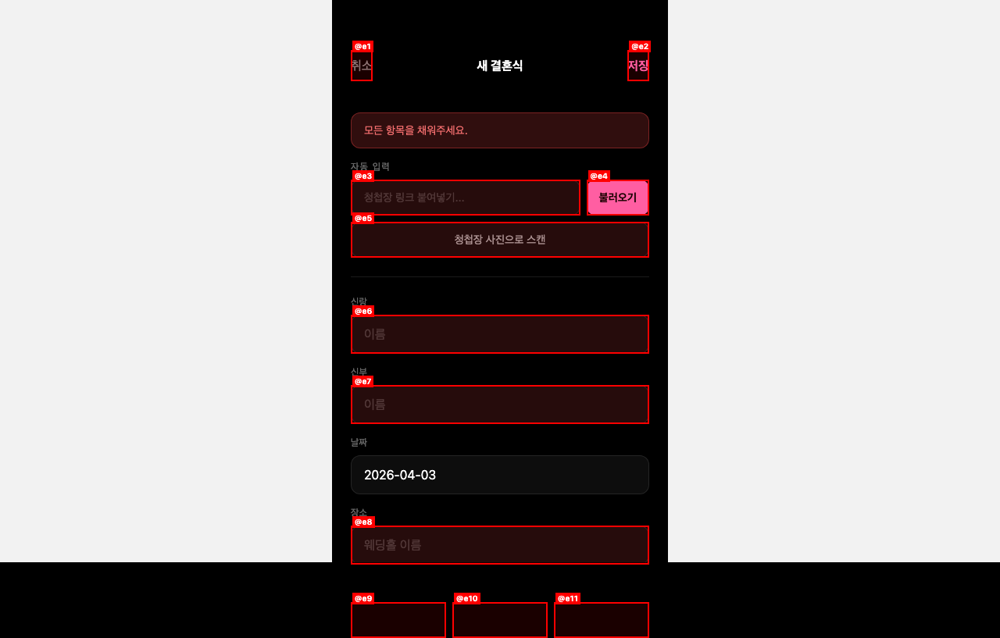
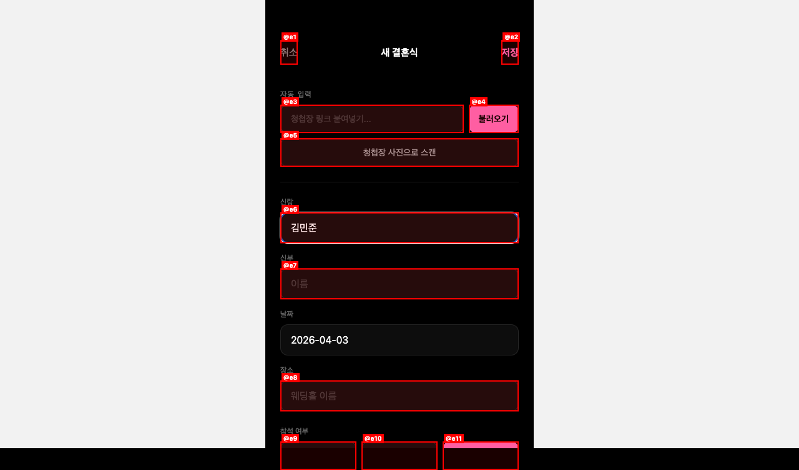

# QA Report — wediary (localhost:8081)
**Date:** 2026-04-03
**Branch:** main
**Framework:** Expo 54 (React Native Web)
**Pages Visited:** 5 (홈, 탭-지난결혼식, 설정, 개인정보처리방침, 새결혼식, 로그인)
**Screenshots:** 17

---

## Summary

| Metric | Value |
|--------|-------|
| Issues Found | 3 |
| Fixed (verified) | 2 |
| Fixed (best-effort) | 0 |
| Deferred | 1 |
| Health Score (baseline) | 90/100 |
| Health Score (final) | 95/100 |

**PR Summary:** QA found 3 issues, fixed 2, health score 90 → 95.

---

## Issues

### ISSUE-001 — 폼 입력 후 에러 배너 자동 클리어 안 됨
- **Severity:** Medium
- **Category:** UX
- **Page:** `/new`
- **Fix Status:** verified
- **Commit:** `7a47b0f`
- **Files Changed:** `app/app/(app)/new.tsx`

**Repro:**
1. `/new` 화면에서 아무것도 입력하지 않고 "저장" 클릭
2. "모든 항목을 채워주세요." 에러 배너 표시됨
3. 신랑 이름 입력 시작 → 에러 배너가 사라지지 않음 (수정 전)

**Fix:** `groom`, `bride`, `venue` TextInput의 `onChangeText`에 `if (formError) setFormError('')` 추가.

**Before:** 
**After:** 

---

### ISSUE-002 — "로그인 없이 계속 (테스트)" 버튼 프로덕션 노출
- **Severity:** Medium
- **Category:** Functional / Security
- **Page:** `/login`
- **Fix Status:** verified (dev에서는 여전히 보임 — __DEV__=true이므로 정상)
- **Commit:** `098d6d6`
- **Files Changed:** `app/app/(auth)/login.tsx`

**Repro:**
1. 로그인 화면 접근
2. "로그인 없이 계속 (테스트)" 버튼이 항상 보임 (`__DEV__` 가드 없음)
3. 프로덕션 빌드에도 노출됨

**Fix:** 버튼을 `{__DEV__ && (...)}` 로 감쌈 — 설정 화면의 "캘린더 연동 테스트 (DEV)"와 동일한 패턴.

---

### ISSUE-003 — `props.pointerEvents is deprecated` 콘솔 경고
- **Severity:** Low
- **Category:** Console
- **Status:** Deferred
- **Note:** Expo 업그레이드 시 자동 해결될 예정. 사용자에게 노출 안 됨.

---

## Health Score Breakdown

| Category | Score | Weight | Weighted |
|----------|-------|--------|---------|
| Console | 70 (경고 3개) | 15% | 10.5 |
| Links | 100 | 10% | 10 |
| Visual | 100 | 10% | 10 |
| Functional | 100 (수정 후) | 20% | 20 |
| UX | 100 (수정 후) | 15% | 15 |
| Performance | 100 | 10% | 10 |
| Content | 100 | 5% | 5 |
| Accessibility | 100 | 15% | 15 |
| **Total** | | | **95.5** |

---

## Observations (Non-Issues)

- **설정 "캘린더 연동 테스트 (DEV)"**: `__DEV__`로 올바르게 가드됨. 정상.
- **계정 이메일 "—"**: 테스트 우회 로그인에서 예상된 동작. Kakao OAuth 로그인 시 이메일 정상 표시.
- **빈 상태 화면**: 예정/지난 탭 각각 다른 아이콘과 메시지. 올바름.
- **개인정보처리방침**: 내용 완성도 높음. Supabase/Kakao 명시.
- **저장 실패 에러 배너 + 스크롤**: ISSUE-002(기존 git)로 이미 구현된 기능. 정상 동작 확인.

---

## Top 3 Things to Fix (Remaining)

1. **ISSUE-003 (Deferred):** `props.pointerEvents` 경고 — Expo SDK 업그레이드로 해결
2. 인증 사용자 정보 로딩 시 스켈레톤 UI (현재 즉시 "—" 표시)
3. 개인정보처리방침 타이틀 자간 이상 (폰트 렌더링 — 웹 only)
